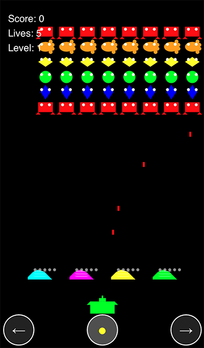

# Space Invaders Mobile (Touch Edition)

Un classico gioco Space Invaders ottimizzato per dispositivi mobili, creato con p5.js e controlli touch.

## 🚀 Deploy su GitHub Pages

1. Assicurati di avere i seguenti file nella repository:
   - `index.html` (o `space_iphone.html` rinominato)
   - `space_iphone.js`
   - `README.md`

2. Vai nelle impostazioni della repository (Settings)
3. Nella sezione "Pages" (sotto "Code and automation")
4. In "Source" seleziona "Deploy from a branch"
5. Seleziona il branch "main" e la cartella "/ (root)"
6. Clicca "Save"

Il gioco sarà disponibile all'URL: `https://[tuo-username].github.io/[nome-repository]`

## 🎮 Come Giocare (versione mobile touch)

- **Muovi il cannone**: usa le frecce touch in basso a sinistra e destra
- **Spara**: premi il pulsante centrale giallo
- **Rigioca**: premi il pulsante "Rigioca" che appare a fine partita
- Il cannone e le barriere sono sempre posizionati sopra i controlli touch
- Il layout si adatta automaticamente a qualsiasi schermo

## 🎯 Caratteristiche

- 6 righe e 8 colonne di nemici, sempre centrati
- Barriere colorate con resistenza crescente
- 5 tipi diversi di nemici con sprite uniche
- Effetti sonori per ogni azione
- Sistema di punteggio
- Livelli progressivi con **aumento di difficoltà lineare** (la velocità degli invasori cresce gradualmente)
- Pulsante "Rigioca" per ripartire facilmente
- Responsive e ottimizzato per smartphone

## 🛠️ Tecnologie Utilizzate

- p5.js per la grafica
- Web Audio API per gli effetti sonori
- HTML5 e CSS3 per l'interfaccia mobile
- JavaScript per la logica di gioco

## 📱 Compatibilità

Il gioco è ottimizzato per:
- Smartphone (iOS e Android)
- Tablet

## 🎨 Personalizzazione

Puoi modificare:
- Colori delle barriere
- Velocità dei nemici
- Dimensione dello schermo
- Effetti sonori

## 📝 Licenza

Questo progetto è rilasciato sotto licenza CC0-1.0 - vedi il file [LICENSE](LICENSE) per i dettagli.

## 🤝 Contribuire

1. Fai il fork del progetto
2. Crea un branch per la tua feature (`git checkout -b feature/AmazingFeature`)
3. Commit delle tue modifiche (`git commit -m 'Add some AmazingFeature'`)
4. Push sul branch (`git push origin feature/AmazingFeature`)
5. Apri una Pull Request

## 📧 Contatti

Per domande o suggerimenti, contattami su GitHub! 
